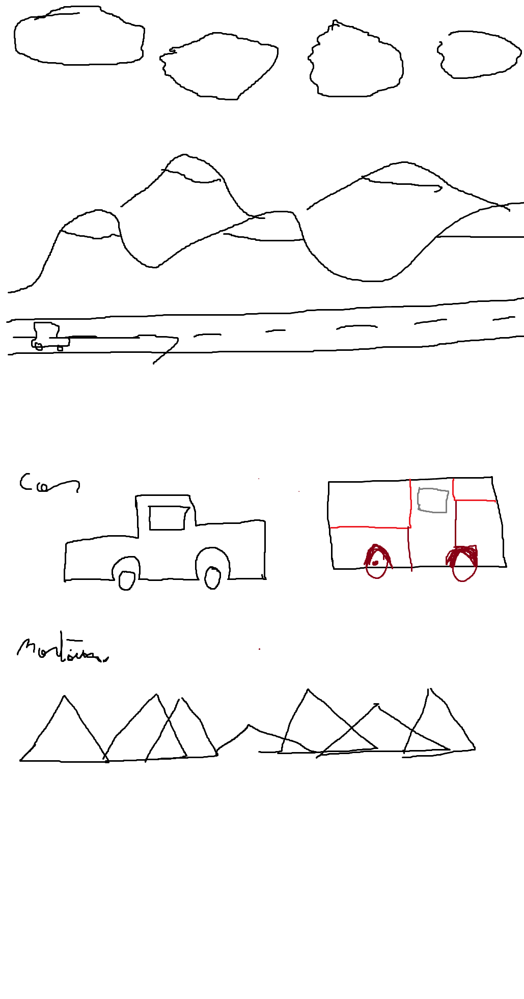
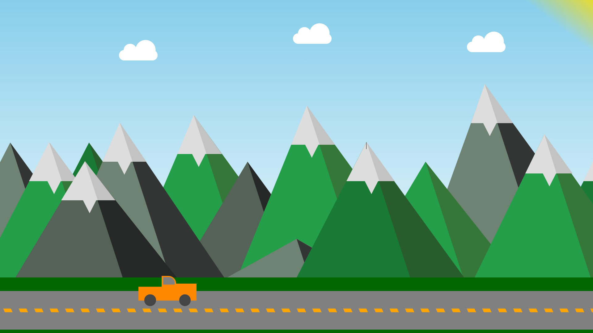

# **Projet CSS Design**  

Il s'agit d'un petit projet de site internet visant à exploiter le CSS et à apprendre à concevoir un design avec. J'avais dessiné une maquette simple sur Paint, puis j'ai commencé à la réaliser le site.  

### **Maquette initiale :**  
  

### **Résultat final :**  
  

Des améliorations et de nouvelles idées viendront sûrement s'ajouter au fil du temps !  
